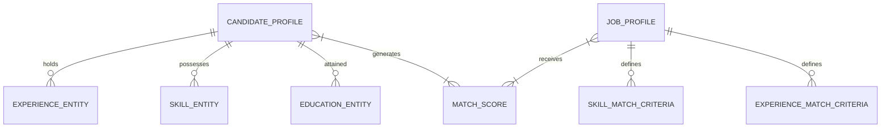

# Zecpath AI Data Entity Design Document

## 1. Overview
This document defines the core data architecture for the Zecpath AI hiring intelligence system. Our goal is to transform unstructured resume PDFs and Job Descriptions (JDs) into machine-readable JSON entities that enable high-precision matching, automated screening, and ranking.

---

## 2. Analyzed Data Attributes

### 2.1 From Resumes
- **Skills:** Normalized entities for hard skills (Languages, Tools, Frameworks) and soft skills (Leadership, Management).
- **Experience Patterns:** Chronological job history, including role duration, company size/industry, and specific quantifiable achievements.
- **Job Designations:** Standardized titles to map "SWE III" to "Senior Software Engineer."
- **Education Structures:** Degree levels (BS, MS, PhD), institutions (Tier-1, Tier-2), and fields of study.
- **Certifications:** Industry-recognized validations (AWS, PMP, CKAD) with validity dates.

### 2.2 From Job Descriptions
- **Required Skills:** Mandatory (Must-have) vs. Preferred (Nice-to-have) technical competencies.
- **Job Roles:** Core responsibilities and the specific impact the role expects.
- **Experience Requirements:** Minimum years of experience and specific industry background (e.g., "5+ years in Fintech").
- **Education Requirements:** Minimum degree thresholds and relevant fields of study.

---

## 3. Standard AI Data Entities

### A. Candidate Profile
The root object for a candidate. It aggregates personal details, summary, and lists of sub-entities (Experience, Education). This is the primary input for the "Matching Engine."

### B. Job Profile
The root object for a job posting. It defines the "Ideal Candidate" criteria through weighted skills, experience thresholds, and responsibilities.

### C. Skill Object
A granular representation of a competency.
- **Fields:** `name`, `proficiency`, `category`, `years_of_experience`.
- **Purpose:** Enables vector-based semantic matching (e.g., "React" vs. "Frontend").

### D. Experience Object
A discrete block of professional history.
- **Fields:** `job_title`, `company`, `duration`, `is_current`, `responsibilities`, `achievements`.
- **Purpose:** Helps AI reconstruct the career trajectory for "Seniority" and "Relevancy" scoring.

---

## 4. Entity Relationships

1. **One-to-Many Relationships:** A single Candidate Profile owns multiple Experience, Education, and Skill entities.
2. **Matching Logic:** The AI takes the `Job Profile` (Criteria) and iterates through the `Candidate Profile` (Supply). The `Experience Object` list is analyzed to check if the sum of durations in relevant roles meets the `Job Profile`'s `min_years` requirement.
3. **Skill Verification:** The system matches `Skill Objects` in the resume against `Required Skills` in the JD, weighing "Required" items higher than "Preferred" items.

---

## 5. Why This Structure is Useful for AI Systems

1. **Elimination of Bias:** By structured entity extraction, the AI focuses on competencies and durations rather than layout or formatting.
2. **Normalized Comparison:** Different people describe the same skill differently (e.g., "Java expert" vs. "5 years of Java development"). Structuring maps these to a unified `Skill Object`.
3. **Explainable AI (XAI):** When the AI ranks a candidate highly, we can point to specific matches between `Job Profile.RequiredSkills` and `Candidate Profile.Skills`.
4. **Searchability at Scale:** Thousands of structured JSON objects can be indexed in a vector database (like Pinecone or Weaviate) for near-instant retrieval based on job requirements.
